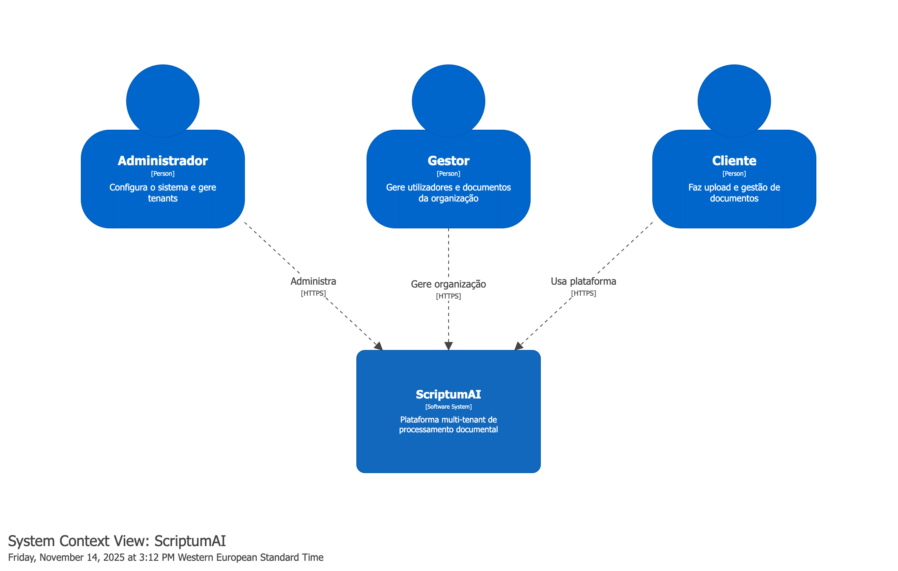
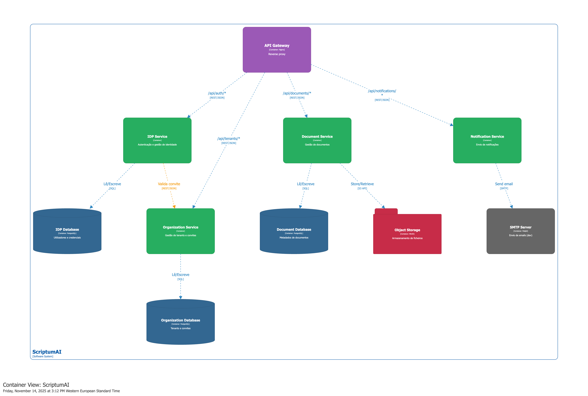
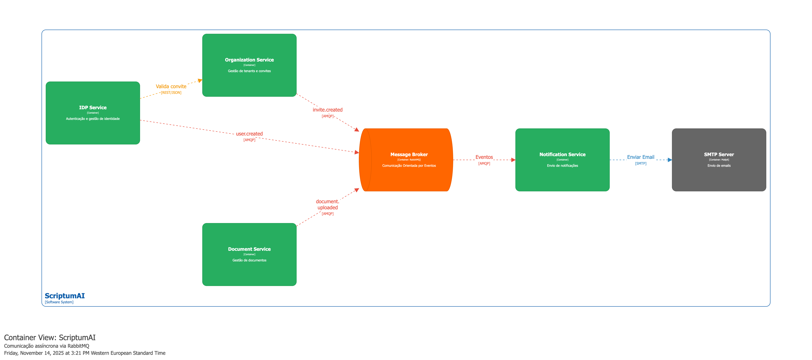
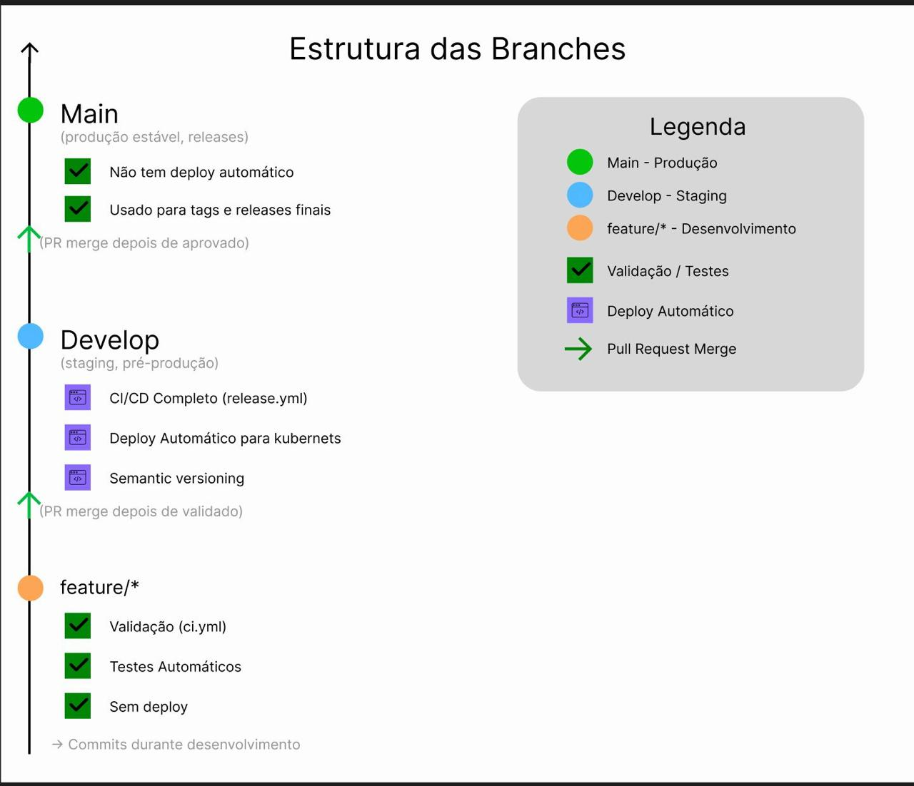

# Microservices Document Management Backend

A multi-tenant document management backend built with microservices architecture, event-driven communication, and deployed on DigitalOcean Kubernetes.

## Overview

This is the backend API for a document management system where organizations can register, manage documents, invite users, and handle notifications through asynchronous events. Built as part of my Master's in Computer Engineering to demonstrate microservices patterns and cloud deployment.

**Key aspects:**

- Multi-tenant architecture with complete data isolation per organization
- Event-driven communication using RabbitMQ for async messaging
- JWT-based authentication and authorization
- Independent microservice deployment and scaling
- Kubernetes orchestration on DigitalOcean

### System Context



## Architecture

The system is composed of four main microservices communicating both synchronously (REST) and asynchronously (RabbitMQ):



### Services

| Service | Technology | Responsibility |
|---------|-----------|---------------|
| **Auth Service** | Node.js/Express | User authentication, JWT tokens |
| **Organization Service** | NestJS | Tenant management, user invitations |
| **Document Service** | NestJS | Document CRUD operations, metadata |
| **Notification Service** | Node.js/Express | Email notifications via RabbitMQ events |

### Event-Driven Communication



When a user is invited to an organization, the system uses async events:

1. Organization service publishes `user.invited` event to RabbitMQ
2. Notification service consumes the event
3. Email notification is sent asynchronously

This decouples services and improves resilience.

## Tech Stack

**Backend:** Node.js 20, NestJS 11, Express.js  
**Database:** PostgreSQL 16  
**Messaging:** RabbitMQ 3  
**ORM:** Prisma, Drizzle  
**Infrastructure:** Docker, Kubernetes (DigitalOcean)  
**Storage:** MinIO/DigitalOcean Spaces  
**API Gateway:** Nginx with rate limiting and CORS

## Getting Started

### Prerequisites

- Node.js 20+
- Docker & Docker Compose
- PostgreSQL 16
- RabbitMQ 3
- kubectl (for Kubernetes deployment)

### Local Development

Start services with Docker Compose:

```bash
docker compose up -d
```

This starts all microservices, PostgreSQL, and RabbitMQ.

### Testing with Postman

1. Import `postman/ScriptumAI_Microservices.postman_collection.json`
2. Import `postman/ScriptumAI_Environment.postman_environment.json`
3. Set `baseUrl` to `http://localhost`
4. Run requests from "Initial Setup" folder

## Deployment

### Kubernetes

Deploy to your cluster:

```bash
kubectl apply -f k8s/
```

### Infrastructure with Terraform

Provision infrastructure on DigitalOcean:

```bash
cd terraform
terraform plan
terraform apply
```

This creates:
- Kubernetes cluster
- Managed PostgreSQL database
- LoadBalancer for API Gateway
- Persistent volumes

## API Endpoints

### Authentication

```
POST   /api/auth/register       - Register new user
POST   /api/auth/login          - Login and get JWT tokens
GET    /api/auth/me             - Get current user profile
POST   /api/auth/refresh        - Refresh access token
```

### Organizations

```
POST   /api/organizations/register   - Bootstrap first organization
GET    /api/organizations            - List organizations
POST   /api/organizations            - Create organization
PUT    /api/organizations/:id        - Update organization
```

### Documents

```
POST   /api/documents           - Create document
GET    /api/documents           - List documents
GET    /api/documents/:id       - Get document details
PUT    /api/documents/:id       - Update document
```

### Invitations

```
POST   /api/invites             - Send user invitation
GET    /api/invites             - List invitations
PATCH  /api/invites/:id/accept  - Accept invitation
```

### Notifications

```
POST   /api/notifications/send            - Send notification
GET    /api/notifications/user/:userId    - Get user notifications
```

## Security

### API Gateway

- Rate limiting: 10 requests/second per IP
- SSL/TLS termination
- Request logging and monitoring

### Service Layer

- JWT validation on every request
- Role-based access control (RBAC)
- Multi-tenant validation (organizationId check)

### Data Layer

- Database-per-service pattern for isolation
- Encrypted database connections
- Secrets managed via Kubernetes Secrets
- No hardcoded credentials

## Testing

Run unit tests:

```bash
cd services/service-name
npm test
```

Run integration tests:

```bash
npm run test:e2e
```

Optional load testing with k6:

```bash
k6 run performance-test.js
```

## CI/CD

GitHub Actions workflow:

1. Build Docker images (multi-platform)
2. Run tests
3. Push to GitHub Container Registry
4. Deploy to Kubernetes

Branch strategy:



## Project Structure

```
scriptumai-microservices-architecture/
├── services/
│   ├── api-gateway/              # Nginx reverse proxy
│   ├── authentication-service/   # Auth microservice
│   ├── organization-service/     # Organizations & invites
│   ├── document-service/         # Document management
│   └── notification-service/     # Email notifications
├── k8s/                          # Kubernetes manifests
│   ├── namespace.yaml
│   ├── config.yaml               # ConfigMaps & Secrets
│   └── *.yaml                    # Service deployments
├── terraform/                    # Infrastructure as Code
│   ├── main.tf
│   ├── variables.tf
│   └── outputs.tf
├── postman/                      # API testing collection
├── infra/                        # Database init scripts
└── docker-compose.yaml           # Local development
```

### Design Patterns

- **Database-per-Service**: Each service has its own database for isolation
- **API Gateway**: Single entry point for all requests
- **Event Sourcing**: Async communication between services

## License

MIT License

## Author

João Vieira  
GitHub: [@joaovieirapt17](https://github.com/joaovieirapt17)

Project developed as part of Master's in Computer Engineering
